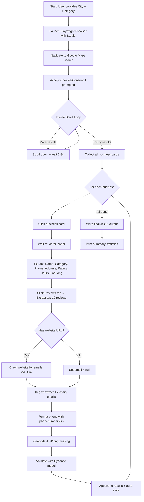

# Google Maps Deep Business Scraper — Implementation Plan

## Goal

Build a production-grade Python script that deeply scrapes **every business** from Google Maps for a given **city + category** (e.g., "restaurants in Lahore"). The scraper will scroll through all results, visit each business detail page, crawl linked websites for emails, and output a comprehensive JSON file.

---

## Architecture Overview

The scraper uses a **3-layer pipeline**:


| Layer | Technology | Responsibility |
|-------|-----------|----------------|
| **Layer 1** | `playwright` + `playwright-stealth` | Navigate Google Maps, infinite scroll, click each listing, extract all visible business data |
| **Layer 2** | `scrapy` + `beautifulsoup4` + `requests` | Crawl each business's website to find emails (contact, about, footer) |
| **Layer 3** | `re` (regex) + `phonenumbers` + `geopy` | Parse/validate emails, format phone numbers internationally, geocode addresses |

---

## User Review Required

> [!IMPORTANT]
> **Email Availability**: Google Maps does **not** display business emails or owner emails directly. The scraper will:
> 1. Extract the business **website URL** from Maps
> 2. Crawl that website (homepage, `/contact`, `/about`) to find email addresses via regex
> 3. Label them as `business_email` — **owner-specific emails cannot be reliably identified** from public data alone
>
> If no website exists or no email is found on the website, the email field will be `null`.

> [!WARNING]
> **Google Maps Result Limit**: Google Maps typically caps visible results at **~120 businesses per search**. To get ALL businesses in a city, the scraper will use **geographic sub-division** — splitting the city into grid cells and searching each cell separately. This dramatically increases coverage but also increases scrape time.

> [!CAUTION]
> **Anti-Bot Detection**: Google actively detects and blocks scrapers. The plan includes stealth measures (random delays, human-like scrolling, `playwright-stealth`), but at scale you may need **proxy rotation**. The initial version will work without proxies but includes a proxy configuration option for scaling.

---

## Open Questions

> [!IMPORTANT]
> 1. **Proxy Support**: Do you want the script to support proxy rotation out of the box (e.g., rotating residential proxies)? Or is running it from your local IP acceptable for now?
> 2. **Scale Expectations**: Approximately how many businesses do you expect per search? (This determines whether we need grid-based sub-division or a single search is enough)
> 3. **Review Count**: How many actual review texts per business do you want? (Google shows up to ~10 most relevant reviews without deep scrolling; extracting hundreds would significantly slow the scraper)
> 4. **Headless Mode**: Should the browser run headless (invisible) or visible (so you can watch the scraping)?

---

## Proposed Changes

### Project Structure

```
d:\Client Hunt Tools\Google Maps Scrapping\
├── gmaps_scraper.py          # Main entry point + CLI
├── config.py                 # Configuration (search params, delays, selectors)
├── scraper/
│   ├── __init__.py
│   ├── maps_browser.py       # Layer 1: Playwright Google Maps automation
│   ├── email_crawler.py      # Layer 2: Website email extraction (Scrapy/BS4)
│   ├── data_enricher.py      # Layer 3: Regex parsing, phone formatting, geocoding
│   └── models.py             # Pydantic data models for business data
├── output/                   # Generated JSON files go here
├── requirements.txt          # All dependencies
└── README.md                 # Usage documentation
```

---

### Component 1: Dependencies & Configuration

#### [NEW] [requirements.txt](file:///d:/Client Hunt Tools/Google Maps Scrapping/requirements.txt)

```
playwright>=1.40.0
playwright-stealth>=1.0.6
scrapy>=2.11.0
beautifulsoup4>=4.12.0
requests>=2.31.0
phonenumbers>=8.13.0
geopy>=2.4.0
pydantic>=2.5.0
lxml>=4.9.0
rich>=13.7.0          # Beautiful CLI output
```

#### [NEW] [config.py](file:///d:/Client Hunt Tools/Google Maps Scrapping/config.py)

Central configuration file containing:
- Default search URL template: `https://www.google.com/maps/search/{query}`
- CSS selectors for all Google Maps elements (business cards, detail panel, reviews, hours)
- Timing constants (scroll delay: 1.5-3s random, page load wait: 2-4s)
- Email regex patterns
- Output directory path
- Optional proxy configuration

---

### Component 2: Data Models

#### [NEW] [scraper/models.py](file:///d:/Client Hunt Tools/Google Maps Scrapping/scraper/models.py)

Pydantic models defining the exact output schema:

```python
class BusinessData:
    business_name: str
    category: str
    sub_category: str              # Granular subcategory from Maps
    business_email: str | None     # Extracted from website crawl
    owner_email: str | None        # Best-effort from website
    phone_number: str | None       # E.164 international format
    phone_number_local: str | None # Local format  
    website_url: str | None
    full_address: str
    latitude: float | None
    longitude: float | None
    opening_hours: dict            # {"Monday": "9:00 AM - 10:00 PM", ...}
    holiday_hours: dict | None     # Special hours if available
    is_currently_open: bool | None
    rating: float | None           # Aggregate score (e.g., 4.5)
    review_count: int | None       # Total review count
    reviews: list[ReviewData]      # Actual review texts
    google_maps_url: str
    place_id: str | None
    scraped_at: str                # ISO timestamp
```

---

### Component 3: Layer 1 — Playwright Maps Browser

#### [NEW] [scraper/maps_browser.py](file:///d:/Client Hunt Tools/Google Maps Scrapping/scraper/maps_browser.py)

This is the **core engine**. It handles all Google Maps browser interactions:

**Phase 1: Search & Infinite Scroll**
1. Launch Chromium via Playwright with stealth settings
2. Navigate to `google.com/maps/search/{category}+in+{city}`
3. Wait for the results feed container (`div[role="feed"]`) to load
4. **Infinite scroll loop**:
   - Scroll the feed container to bottom (`el.scrollTo(0, el.scrollHeight)`)
   - Wait 2-3 seconds (randomized)
   - Check if new results loaded (compare child count)
   - Detect "end of list" marker (`div.HlvSq` or text "You've reached the end")
   - Repeat until no more results load
5. Collect all business card elements

**Phase 2: Detail Extraction (per business)**
For each business card found:
1. Click the card to open the detail panel
2. Wait for the detail panel to fully render
3. Extract using CSS selectors:

| Data Field | Extraction Method |
|-----------|-------------------|
| **Business Name** | `h1.DUwDvf` or `h1[class*="fontHeadlineLarge"]` |
| **Category** | `button[jsaction*="category"]` text content |
| **Sub-category** | Additional category chips/labels below main category |
| **Phone** | `button[data-item-id*="phone"] .Io6YTe` or aria-label containing phone |
| **Website** | `a[data-item-id="authority"]` href |
| **Address** | `button[data-item-id="address"] .Io6YTe` |
| **Rating** | `div.F7nice span[aria-hidden]` |
| **Review Count** | `span[aria-label*="reviews"]` parsed with regex |
| **Hours** | Click hours dropdown → extract `table.eK4R0e` rows |
| **Open/Closed** | `span[class*="ZDu9vd"]` or open/closed indicator |
| **Lat/Long** | Parse from URL (`@lat,lng,zoom`) after page loads |
| **Place ID** | Parse from URL or `data-pid` attribute |

**Phase 3: Review Extraction**
1. Click "Reviews" tab in detail panel
2. Wait for reviews to load
3. Extract up to **10 most relevant reviews**:
   - Reviewer name
   - Rating (stars)
   - Review text (click "More" to expand if truncated)
   - Review date
4. Navigate back to results list

**Anti-Detection Measures:**
- `playwright-stealth` to mask automation signals
- Random delays between actions (1-4 seconds, gaussian distribution)
- Human-like mouse movements before clicks
- Random viewport sizes
- Occasional scroll-up behavior (mimics human reading)

---

### Component 4: Layer 2 — Email Crawler

#### [NEW] [scraper/email_crawler.py](file:///d:/Client Hunt Tools/Google Maps Scrapping/scraper/email_crawler.py)

For each business that has a `website_url`:

1. **Requests + BeautifulSoup** approach (faster than full Scrapy for simple crawls):
   - Fetch the homepage
   - Fetch `/contact`, `/about`, `/about-us`, `/contact-us` if they exist
   - Parse HTML with BeautifulSoup + lxml parser

2. **Email extraction** via multiple strategies:
   - **Regex scan**: `r'[a-zA-Z0-9._%+-]+@[a-zA-Z0-9.-]+\.[a-zA-Z]{2,}'` on page text
   - **mailto: links**: `soup.select('a[href^="mailto:"]')`
   - **Structured data**: Parse JSON-LD (`<script type="application/ld+json">`) for `email` field
   - **Meta tags**: Check `<meta>` tags for email content

3. **Email classification**:
   - Emails matching `info@`, `contact@`, `hello@`, `support@` → `business_email`
   - Emails matching personal name patterns → `owner_email` (best effort)
   - Filter out generic emails (`noreply@`, `no-reply@`, image/file emails)

4. **Rate limiting**: 1 second delay between website requests to avoid blocks

---

### Component 5: Layer 3 — Data Enrichment

#### [NEW] [scraper/data_enricher.py](file:///d:/Client Hunt Tools/Google Maps Scrapping/scraper/data_enricher.py)

Post-processing layer that cleans and enriches raw scraped data:

1. **Phone Number Formatting** (`phonenumbers` library):
   - Parse raw phone string → format to E.164 (`+923001234567`)
   - Also provide national format (`0300 1234567`)
   - Auto-detect country code from city/address

2. **Address Geocoding** (`geopy` with Nominatim):
   - If lat/long not extracted from Maps URL, geocode the address
   - Fallback geocoding for addresses that fail URL extraction

3. **Data Validation** (Pydantic):
   - Validate all fields match expected types
   - Clean HTML entities from text fields
   - Normalize Unicode characters
   - Deduplicate businesses by name + address

---

### Component 6: Main Entry Point & CLI

#### [NEW] [gmaps_scraper.py](file:///d:/Client Hunt Tools/Google Maps Scrapping/gmaps_scraper.py)

Rich CLI interface with progress tracking:

```
python gmaps_scraper.py --city "Lahore" --category "restaurants"
python gmaps_scraper.py --city "New York" --category "dentists" --max-results 500
python gmaps_scraper.py --city "London" --category "doctors" --headless
```

Features:
- `rich` library for beautiful console output with progress bars
- Real-time stats: businesses found, emails extracted, errors
- Auto-saves progress every 20 businesses (crash recovery)
- Final output: `output/{city}_{category}_{timestamp}.json`

---

### Output JSON Structure

```json
{
  "metadata": {
    "city": "Lahore",
    "category": "restaurants",
    "total_businesses": 127,
    "scrape_started": "2026-07-30T19:30:00+05:00",
    "scrape_completed": "2026-07-30T20:15:00+05:00"
  },
  "businesses": [
    {
      "business_name": "Cafe Zouk",
      "category": "Restaurant",
      "sub_category": "Pakistani Restaurant, Fine Dining",
      "business_email": "info@cafezouk.com",
      "owner_email": null,
      "phone_number": "+924235761234",
      "phone_number_local": "(042) 3576-1234",
      "website_url": "https://cafezouk.com",
      "full_address": "8-C, MM Alam Road, Gulberg III, Lahore, Punjab 54660, Pakistan",
      "latitude": 31.5204,
      "longitude": 74.3587,
      "opening_hours": {
        "Monday": "12:00 PM – 1:00 AM",
        "Tuesday": "12:00 PM – 1:00 AM",
        "...": "..."
      },
      "holiday_hours": null,
      "is_currently_open": true,
      "rating": 4.3,
      "review_count": 12847,
      "reviews": [
        {
          "reviewer_name": "Ahmed K.",
          "rating": 5,
          "text": "Amazing food and ambiance...",
          "date": "2 months ago"
        }
      ],
      "google_maps_url": "https://maps.google.com/?cid=...",
      "place_id": "ChIJ...",
      "scraped_at": "2026-07-30T19:35:22+05:00"
    }
  ]
}
```

---

## Execution Flow



---

## Verification Plan

### Automated Tests
1. **Dry run**: `python gmaps_scraper.py --city "Lahore" --category "restaurants" --max-results 5`
   - Verify 5 businesses are scraped with all fields populated
   - Verify JSON output file is valid and matches schema
2. **Email extraction test**: Manually verify 3 businesses' emails against their actual websites
3. **Phone format test**: Verify phone numbers are in correct E.164 format
4. **Geocoding test**: Verify lat/long values are within the expected city bounds

### Manual Verification
- Open the output JSON and spot-check 10 random businesses
- Compare scraped data against Google Maps UI for accuracy
- Verify opening hours match what's displayed on Maps
- Confirm review texts are complete (not truncated)
